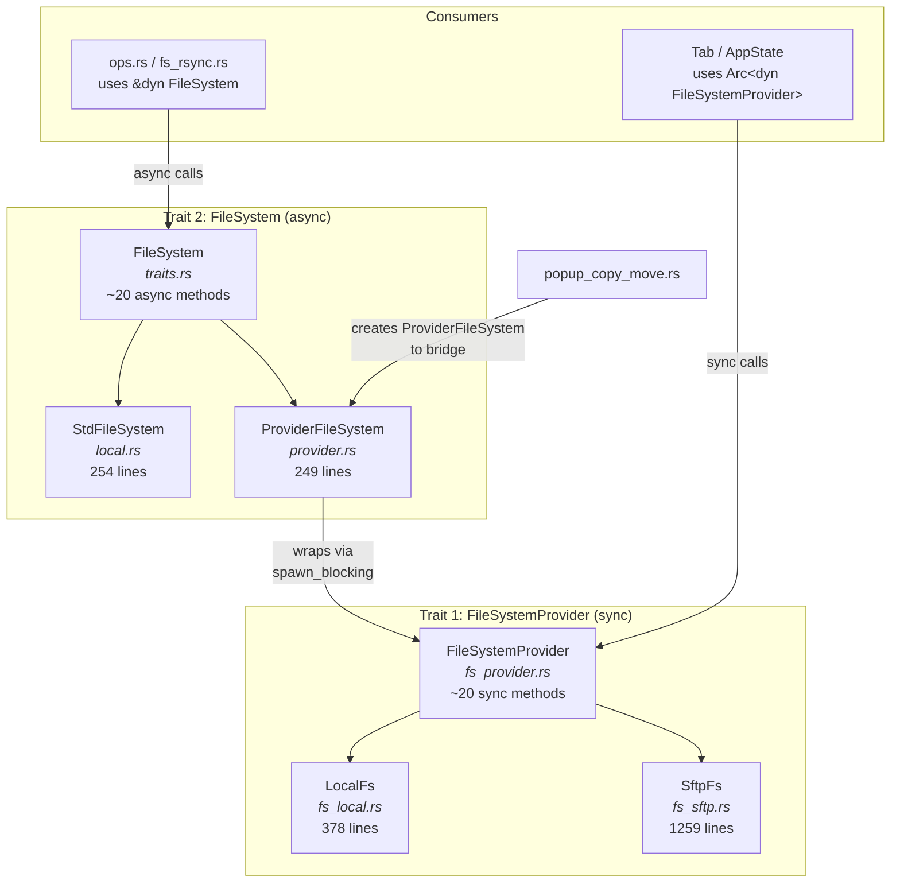

# Refactoring Opportunities Plan

A comprehensive analysis of the codebase (~82 source files) to identify architectural issues, unidiomatic Rust patterns, and long functions. **No changes should be made yet** — this document catalogues findings and proposes solutions.

---

## Priority 1: Test Boilerplate — [AppState](file:///home/gkalab/git/fm_rust/src/app.rs#60-88) Construction

### Problem
[AppState](file:///home/gkalab/git/fm_rust/src/app.rs#60-88) construction in tests is duplicated **verbatim** ~7 times across [event_loop.rs](file:///home/gkalab/git/fm_rust/src/event_loop.rs) and [handlers/editor.rs](file:///home/gkalab/git/fm_rust/src/handlers/editor.rs), each copy being ~60 lines. This is the single biggest maintainability problem in the codebase — every new field added to [AppState](file:///home/gkalab/git/fm_rust/src/app.rs#60-88) requires updating every copy.

### Affected Files
- [event_loop.rs](file:///home/gkalab/git/fm_rust/src/event_loop.rs#L239-L304) — 4 copies
- [editor.rs](file:///home/gkalab/git/fm_rust/src/handlers/editor.rs#L449-L509) — 2+ copies
- [app.rs](file:///home/gkalab/git/fm_rust/src/app.rs#L789-L830) — 1 copy

### Proposed Solution
Add a `#[cfg(test)]` helper in [app.rs](file:///home/gkalab/git/fm_rust/src/app.rs):

```rust
#[cfg(test)]
impl AppState {
    pub fn test_default() -> Self {
        Self {
            left: TabManager { tabs: vec![...], active_tab_index: 0 },
            right: TabManager { tabs: vec![...], active_tab_index: 0 },
            active: PanelSide::Left,
            // ... all fields with sensible test defaults
        }
    }
}
```

Then each test just calls `AppState::test_default()` and overrides the 1-2 fields it actually cares about.

**Estimated impact**: Eliminates ~400 lines of duplicated boilerplate, makes adding new [AppState](file:///home/gkalab/git/fm_rust/src/app.rs#60-88) fields a 1-line change instead of 7+.

---

## Priority 2: Repeated `match app.active` Pattern

### Problem
The pattern `match app.active { PanelSide::Left => &mut app.left, PanelSide::Right => &mut app.right }` appears **10+ times** across multiple handlers. This is already partially addressed by [active_tab_manager()](file:///home/gkalab/git/fm_rust/src/app.rs#279-286) / [active_tab_manager_mut()](file:///home/gkalab/git/fm_rust/src/app.rs#287-294) methods on [AppState](file:///home/gkalab/git/fm_rust/src/app.rs#60-88), but many call sites still use the raw match.

### Affected Files
- [input.rs](file:///home/gkalab/git/fm_rust/src/handlers/input.rs) — lines 44, 148, 366
- [editor.rs](file:///home/gkalab/git/fm_rust/src/handlers/editor.rs) — lines 313, 340
- [terminal.rs](file:///home/gkalab/git/fm_rust/src/handlers/terminal.rs) — lines 192, 223
- [main_handler.rs](file:///home/gkalab/git/fm_rust/src/handlers/main_handler.rs) — line 178
- [popup_fuzzy.rs](file:///home/gkalab/git/fm_rust/src/handlers/popup_fuzzy.rs) — line 32
- [app.rs](file:///home/gkalab/git/fm_rust/src/app.rs#L319-L322) — [handle_ssh_connected](file:///home/gkalab/git/fm_rust/src/app.rs#318-360)

### Proposed Solution
Replace all raw `match app.active` occurrences with calls to the existing [active_tab_manager()](file:///home/gkalab/git/fm_rust/src/app.rs#279-286) / [active_tab_manager_mut()](file:///home/gkalab/git/fm_rust/src/app.rs#287-294) helper methods. For the [handle_tab](file:///home/gkalab/git/fm_rust/src/handlers/input.rs#162-189) navigation case that toggles the active side, use a dedicated `toggle_active_panel()` method.

**Estimated impact**: Improves consistency, reduces each call site by 2-3 lines.

---

## Priority 3: Long Functions

### Functions exceeding ~150 lines

| Function | File | Lines | Notes |
|----------|------|-------|-------|
| [draw_panel](file:///home/gkalab/git/fm_rust/src/ui/panel.rs#61-355) | [panel.rs](file:///home/gkalab/git/fm_rust/src/ui/panel.rs#L61-L354) | ~293 | Mixes column width calculation, entry styling, search highlighting, border drawing |
| [handle_ssh_connection_event](file:///home/gkalab/git/fm_rust/src/handlers/popup_ssh.rs#26-258) | [popup_ssh.rs](file:///home/gkalab/git/fm_rust/src/handlers/popup_ssh.rs#L26-L257) | ~231 | Handles all field navigation, history, and connection initiation |
| [spawn_copy_move_task](file:///home/gkalab/git/fm_rust/src/handlers/popup_copy_move.rs#473-640) | [popup_copy_move.rs](file:///home/gkalab/git/fm_rust/src/handlers/popup_copy_move.rs#L473-L639) | ~166 | Already partially refactored (helper functions extracted), the async closure is still large |
| [recursive_op](file:///home/gkalab/git/fm_rust/src/fs/ops.rs#169-213) | [ops.rs](file:///home/gkalab/git/fm_rust/src/fs/ops.rs#L172-L400) | ~228 | Complex iterative recursive operation with work queue |
| [download](file:///home/gkalab/git/fm_rust/src/fs/traits.rs#63-74) / [upload](file:///home/gkalab/git/fm_rust/src/fs/provider.rs#239-248) | [fs_sftp.rs](file:///home/gkalab/git/fm_rust/src/fs/fs_sftp.rs#L393-L607) | ~215 | Chunked file transfer with progress reporting — download and upload are structurally similar |
| [handle_main_panel_event](file:///home/gkalab/git/fm_rust/src/handlers/input.rs#25-161) | [input.rs](file:///home/gkalab/git/fm_rust/src/handlers/input.rs#L25-L160) | ~135 | Already well-structured with helper function extraction |

### Proposed Solutions

#### [draw_panel](file:///home/gkalab/git/fm_rust/src/ui/panel.rs#61-355) → Extract sub-functions
```
draw_panel
├── calculate_column_widths(entries, area) -> ColumnWidths
├── style_file_entry(entry, palette, active) -> Style  
├── render_entry_row(entry, widths, search_matches) -> Row
├── draw_panel_border(frame, area, palette, active)
└── draw_scrollbar(frame, area, entries_len, scroll_offset)
```

#### [handle_ssh_connection_event](file:///home/gkalab/git/fm_rust/src/handlers/popup_ssh.rs#26-258) → State machine or sub-handlers
- Extract `handle_ssh_field_navigation(...)` for Tab/BackTab cycling
- Extract `handle_ssh_history_search(...)` for history interaction
- Extract `handle_ssh_text_input(...)` for character-by-character editing

#### [download](file:///home/gkalab/git/fm_rust/src/fs/traits.rs#63-74) / [upload](file:///home/gkalab/git/fm_rust/src/fs/provider.rs#239-248) in [fs_sftp.rs](file:///home/gkalab/git/fm_rust/src/fs/fs_sftp.rs) → Unify chunked transfer
Both methods share the same loop structure (chunk read → chunk write → update progress → check cancellation). Extract a generic `chunked_transfer(reader, writer, progress)` helper.

---

## Priority 4: Error Type Inconsistency

### Problem
The codebase mixes `Result<(), String>`, `anyhow::Result<()>`, and ad-hoc error patterns:

| Pattern | Where |
|---------|-------|
| `Result<(), String>` | [ops.rs](file:///home/gkalab/git/fm_rust/src/fs/ops.rs) (recursive_op, work items) |
| `Result<(), String>` | [config.rs](file:///home/gkalab/git/fm_rust/src/config.rs) (all validate_* functions) |
| `Result<(), String>` | [app.rs](file:///home/gkalab/git/fm_rust/src/app.rs#L261) (can_swap_active_tabs) |
| `anyhow::Result<()>` | [fs_sftp.rs](file:///home/gkalab/git/fm_rust/src/fs/fs_sftp.rs), [fs_local.rs](file:///home/gkalab/git/fm_rust/src/fs/fs_local.rs) |
| `Option<String>` for errors | [popup_copy_move.rs](file:///home/gkalab/git/fm_rust/src/handlers/popup_copy_move.rs#L154) (validate_copy_move) |

### Proposed Solution
1. Migrate `Result<(), String>` usages in [fs/ops.rs](file:///home/gkalab/git/fm_rust/src/fs/ops.rs) to `anyhow::Result<()>` or a dedicated `FsOpError` enum
2. Migrate validation functions in [config.rs](file:///home/gkalab/git/fm_rust/src/config.rs) to use `anyhow::Result<()>` or a `ConfigError` type  
3. Convert [validate_copy_move() -> Option<String>](file:///home/gkalab/git/fm_rust/src/handlers/popup_copy_move.rs#152-231) to [validate_copy_move() -> Result<(), String>](file:///home/gkalab/git/fm_rust/src/handlers/popup_copy_move.rs#152-231)

> [!NOTE]
> This is a gradual migration. `anyhow` is already a dependency and is the dominant pattern. The `String` error paths exist only in a few modules.

---

## Priority 5: `#[allow(clippy::too_many_arguments)]`

### Problem
[try_rsync_directory](file:///home/gkalab/git/fm_rust/src/handlers/popup_copy_move.rs#L344-L395) takes 12 parameters and requires `#[allow(clippy::too_many_arguments)]`.

### Proposed Solution
Introduce a `TransferContext` struct to bundle the shared parameters:

```rust
struct TransferContext<'a> {
    decision_state: &'a mut DecisionState,
    decision_rx: &'a Arc<Mutex<Receiver<TaskDecision>>>,
    tx: &'a UnboundedSender<TaskEvent>,
    cancel: &'a Arc<AtomicBool>,
    processed_items: &'a Arc<AtomicUsize>,
    processed_bytes: &'a Arc<AtomicU64>,
    id: usize,
    total_items: usize,
}
```

This also applies to [RecursiveOpContext](file:///home/gkalab/git/fm_rust/src/fs/ops.rs#67-84) in [ops.rs](file:///home/gkalab/git/fm_rust/src/fs/ops.rs) which already uses a context struct — good pattern to replicate.

---

## Priority 6: Structural Duplication in [SftpFs](file:///home/gkalab/git/fm_rust/src/fs/fs_sftp.rs#8-15)

### Problem
In [fs_sftp.rs](file:///home/gkalab/git/fm_rust/src/fs/fs_sftp.rs), many methods follow the exact same pattern:
```rust
fn some_method(&self, path: &Path) -> Result<T> {
    self.with_sftp(|sftp| {
        let normalized = self.normalize_path(path);
        sftp.some_operation(&normalized)
            .map_err(|e| anyhow!("Failed to ...: {}", e))
    })
}
```

This [normalize_path](file:///home/gkalab/git/fm_rust/src/fs/fs_sftp.rs#43-55) + [with_sftp](file:///home/gkalab/git/fm_rust/src/fs/fs_sftp.rs#29-42) + `map_err` pattern appears in: [list_dir](file:///home/gkalab/git/fm_rust/src/fs/fs_sftp.rs#896-907), [create_dir](file:///home/gkalab/git/fm_rust/src/fs/fs_sftp.rs#138-144), [create_file](file:///home/gkalab/git/fm_rust/src/fs/fs_sftp.rs#145-152), [delete](file:///home/gkalab/git/fm_rust/src/fs/fs_local.rs#39-51), [rename](file:///home/gkalab/git/fm_rust/src/fs/local.rs#27-30), [read_file](file:///home/gkalab/git/fm_rust/src/handlers/editor.rs#519-522), [read_file_at](file:///home/gkalab/git/fm_rust/src/app.rs#720-728), [write_file](file:///home/gkalab/git/fm_rust/src/fs/fs_sftp.rs#216-227), [write_file_at](file:///home/gkalab/git/fm_rust/src/app.rs#731-739), [exists](file:///home/gkalab/git/fm_rust/src/fs/fs_local.rs#115-118), [is_dir](file:///home/gkalab/git/fm_rust/src/fs/ops.rs#626-635), [canonicalize](file:///home/gkalab/git/fm_rust/src/app.rs#751-754), [get_permissions](file:///home/gkalab/git/fm_rust/src/fs/fs_sftp.rs#305-314), [set_permissions](file:///home/gkalab/git/fm_rust/src/fs/provider.rs#164-176), [get_modified_time](file:///home/gkalab/git/fm_rust/src/fs/fs_sftp.rs#335-347), [set_modified_time](file:///home/gkalab/git/fm_rust/src/fs/ops.rs#759-766) (~16 methods).

### Proposed Solution
Consider a helper for the most common case:
```rust
fn sftp_op<F, T>(&self, path: &Path, op_name: &str, f: F) -> Result<T>
where
    F: FnOnce(&ssh2::Sftp, &Path) -> Result<T, ssh2::Error>,
{
    self.with_sftp(|sftp| {
        let normalized = self.normalize_path(path);
        f(sftp, &normalized).map_err(|e| anyhow!("Failed to {}: {}", op_name, e))
    })
}
```

> [!TIP]
> This is a lower-priority cleanup. The current code is correct and readable, just verbose.

---

## Priority 7: Minor Idiomatic Rust Improvements

### 7a. `unwrap()` usage
`unwrap()` appears in **21 source files**. Most are in tests (acceptable) or with `.unwrap_or()` / `.unwrap_or_else()` (fine). Review needed for production code paths:

- [app.rs:409](file:///home/gkalab/git/fm_rust/src/app.rs#L409) — `current_dir().unwrap_or_else(|_| PathBuf::from("/"))` ✅ already handled
- [ssh_manager.rs](file:///home/gkalab/git/fm_rust/src/ssh_manager.rs) — needs audit for `unwrap()` in connection paths

### 7b. Stale comments in [input.rs](file:///home/gkalab/git/fm_rust/src/handlers/input.rs)
[input.rs:434-441](file:///home/gkalab/git/fm_rust/src/handlers/input.rs#L434-L441) contains old TODO/investigation comments that are no longer relevant:
```rust
// These functions were local in event_loop.rs or imported?
// handle_sort was called in event_loop.rs line 847.
// ...
```
These should be removed.

### 7c. `clone()` usage
`clone()` appears in 35+ files. Most are necessary (cloning `Arc`, `PathBuf`, `String`). A targeted review could identify unnecessary clones, particularly in:
- Event handler argument passing
- Path construction (could use `&str` or references instead)

---

## Priority 8: [event_loop.rs](file:///home/gkalab/git/fm_rust/src/event_loop.rs) Inconsistent Indentation

### Problem
The `tokio::select!` block in [run_event_loop](file:///home/gkalab/git/fm_rust/src/event_loop.rs#L66-L143) has inconsistent indentation — some branches are indented at different levels. The [handle_event](file:///home/gkalab/git/fm_rust/src/event_loop.rs#203-212) drain loop (lines 78-87) is left-aligned differently from the surrounding code.

### Proposed Solution
Normalize indentation throughout the function. This is purely cosmetic but aids readability.

---

## Priority 9: Filesystem Architecture — Dual-Trait Hierarchy

### Current Architecture

The [fs/](file:///home/gkalab/git/fm_rust/src/fs/fs_local.rs#229-238) module has **11 files** and **two separate trait hierarchies** that serve overlapping purposes:



### Issues Identified

#### 9a. Two local filesystem implementations
- [StdFileSystem](file:///home/gkalab/git/fm_rust/src/fs/local.rs) (254 lines) — implements [FileSystem](file:///home/gkalab/git/fm_rust/src/fs/traits.rs#12-86) (async trait)
- [LocalFs](file:///home/gkalab/git/fm_rust/src/fs/fs_local.rs) (378 lines) — implements [FileSystemProvider](file:///home/gkalab/git/fm_rust/src/fs/fs_provider.rs#15-132) (sync trait)

These do the same thing but with different APIs. [StdFileSystem](file:///home/gkalab/git/fm_rust/src/fs/local.rs#6-7) is only used directly in [ops.rs](file:///home/gkalab/git/fm_rust/src/fs/ops.rs) tests. In production the local path goes: [LocalFs](file:///home/gkalab/git/fm_rust/src/fs/fs_local.rs#16-17) → wrapped in [ProviderFileSystem](file:///home/gkalab/git/fm_rust/src/fs/provider.rs#5-6) → used as `dyn FileSystem`.

**Recommendation**: [StdFileSystem](file:///home/gkalab/git/fm_rust/src/fs/local.rs#6-7) can be removed from production use. It's only needed in tests. In production, [ProviderFileSystem(Arc::new(LocalFs::new()))](file:///home/gkalab/git/fm_rust/src/fs/provider.rs#5-6) is the path that's actually used. Consider marking [StdFileSystem](file:///home/gkalab/git/fm_rust/src/fs/local.rs#6-7) as `#[cfg(test)]` or unifying the two.

#### 9b. The [ProviderFileSystem](file:///home/gkalab/git/fm_rust/src/fs/provider.rs#5-6) adapter is boilerplate-heavy
[provider.rs](file:///home/gkalab/git/fm_rust/src/fs/provider.rs) (249 lines) is a mechanical wrapper that converts every sync [FileSystemProvider](file:///home/gkalab/git/fm_rust/src/fs/fs_provider.rs#15-132) method into an async [FileSystem](file:///home/gkalab/git/fm_rust/src/fs/traits.rs#12-86) method via `spawn_blocking`. Every method follows this exact pattern:

```rust
async fn method(&self, path: &Path) -> Result<T> {
    let p = self.0.clone();
    let path = path.to_path_buf();
    Ok(tokio::task::spawn_blocking(move || p.method(&path)).await??)
}
```

This is repeated ~20 times. While not incorrect, it's a large amount of adapter code.

**Recommendation**: Consider a macro to generate the adapter methods, e.g.:

```rust
macro_rules! delegate_blocking {
    ($method:ident, $ret:ty, $($arg:ident: $arg_ty:ty),*) => {
        async fn $method(&self, $($arg: $arg_ty),*) -> $ret {
            let p = self.0.clone();
            $(let $arg = $arg.to_owned();)*
            tokio::task::spawn_blocking(move || p.$method($(&$arg),*)).await??
        }
    };
}
```

This would reduce [provider.rs](file:///home/gkalab/git/fm_rust/src/fs/provider.rs) from ~249 lines to ~60.

> [!IMPORTANT]
> The fundamental question is whether the dual-trait design is intentional and worth the complexity. The reason for two traits appears to be: [FileSystemProvider](file:///home/gkalab/git/fm_rust/src/fs/fs_provider.rs#15-132) is **sync** because it's called from the main UI thread (tab browsing, listing directories), while [FileSystem](file:///home/gkalab/git/fm_rust/src/fs/traits.rs#12-86) is **async** because it's called from background tasks (copy/move operations). This is a valid architectural choice for a TUI app — keeping the UI thread responsive. A unification into a single async trait would likely complicate UI code or require blocking in the event loop.
>
> **Verdict**: The dual-trait design is reasonable. Focus refactoring on reducing the adapter boilerplate rather than merging the traits.

#### 9c. [normalize_path](file:///home/gkalab/git/fm_rust/src/fs/fs_sftp.rs#43-55) and [display_path](file:///home/gkalab/git/fm_rust/src/fs/fs_local.rs#220-223) are duplicated in [SftpFs](file:///home/gkalab/git/fm_rust/src/fs/fs_sftp.rs#8-15)

In [fs_sftp.rs](file:///home/gkalab/git/fm_rust/src/fs/fs_sftp.rs), [normalize_path](file:///home/gkalab/git/fm_rust/src/fs/fs_sftp.rs#43-55) (lines 43-54) and [display_path](file:///home/gkalab/git/fm_rust/src/fs/fs_local.rs#220-223) (lines 382-391) contain **identical logic** — both replace backslashes, ensure a leading `/`, and collapse double slashes:

```diff
// normalize_path (line 43)
 let mut s = path.to_string_lossy().replace('\\', "/");
 if !s.starts_with('/') { s = format!("/{}", s); }
 while s.contains("//") { s = s.replace("//", "/"); }
-PathBuf::from(s)
+s  // identical logic, different return type
// display_path (line 382)
```

**Recommendation**: Have [display_path](file:///home/gkalab/git/fm_rust/src/fs/fs_local.rs#220-223) call `self.normalize_path(path).to_string_lossy().to_string()` instead of reimplementing the same logic.

#### 9d. [download](file:///home/gkalab/git/fm_rust/src/fs/traits.rs#63-74) method bypasses [with_sftp](file:///home/gkalab/git/fm_rust/src/fs/fs_sftp.rs#29-42) self-access pattern

Both [download](file:///home/gkalab/git/fm_rust/src/fs/fs_sftp.rs#L393-L508) and [upload](file:///home/gkalab/git/fm_rust/src/fs/fs_sftp.rs#L510-L607) in [SftpFs](file:///home/gkalab/git/fm_rust/src/fs/fs_sftp.rs#8-15) _do not use_ the [with_sftp](file:///home/gkalab/git/fm_rust/src/fs/fs_sftp.rs#29-42) helper consistently. Instead, [download](file:///home/gkalab/git/fm_rust/src/fs/traits.rs#63-74) manually acquires the session mutex, opens an SFTP channel, and then calls `self.with_sftp` separately for stats — mixing two access patterns in the same function.

The [download](file:///home/gkalab/git/fm_rust/src/fs/traits.rs#63-74) method also opens the SFTP channel twice: once for `total_size` (manual lock, lines 402-422) and once for the file (via [with_sftp](file:///home/gkalab/git/fm_rust/src/fs/fs_sftp.rs#29-42), lines 428-441). This is at minimum redundant and potentially fragile.

**Recommendation**: Refactor [download](file:///home/gkalab/git/fm_rust/src/fs/traits.rs#63-74) to use a single SFTP session acquisition. Consider a `with_sftp_extended` that returns the SFTP handle for multi-step operations, or move the stat+open into a single [with_sftp](file:///home/gkalab/git/fm_rust/src/fs/fs_sftp.rs#29-42) call.

#### 9e. [FileSystemProvider](file:///home/gkalab/git/fm_rust/src/fs/fs_provider.rs#15-132) trait has grown organically

The [FileSystemProvider](file:///home/gkalab/git/fm_rust/src/fs/fs_provider.rs) trait has **20+ methods** — many of which are only used in specific scenarios. The trait surfaces look like this:

| Category | Methods |
|----------|---------|
| CRUD | [list_dir](file:///home/gkalab/git/fm_rust/src/fs/fs_sftp.rs#896-907), [create_dir](file:///home/gkalab/git/fm_rust/src/fs/fs_sftp.rs#138-144), [create_file](file:///home/gkalab/git/fm_rust/src/fs/fs_sftp.rs#145-152), [delete](file:///home/gkalab/git/fm_rust/src/fs/fs_local.rs#39-51), [rename](file:///home/gkalab/git/fm_rust/src/fs/local.rs#27-30) |
| Read/Write | [read_file](file:///home/gkalab/git/fm_rust/src/handlers/editor.rs#519-522), [read_file_at](file:///home/gkalab/git/fm_rust/src/app.rs#720-728), [write_file](file:///home/gkalab/git/fm_rust/src/fs/fs_sftp.rs#216-227), [write_file_at](file:///home/gkalab/git/fm_rust/src/app.rs#731-739), [write_file_with_permissions](file:///home/gkalab/git/fm_rust/src/fs/fs_sftp.rs#256-272), [read_file_content](file:///home/gkalab/git/fm_rust/src/fs/fs_provider.rs#60-69) |
| Metadata | [get_permissions](file:///home/gkalab/git/fm_rust/src/fs/fs_sftp.rs#305-314), [set_permissions](file:///home/gkalab/git/fm_rust/src/fs/provider.rs#164-176), [get_modified_time](file:///home/gkalab/git/fm_rust/src/fs/fs_sftp.rs#335-347), [set_modified_time](file:///home/gkalab/git/fm_rust/src/fs/ops.rs#759-766), [exists](file:///home/gkalab/git/fm_rust/src/fs/fs_local.rs#115-118), [is_dir](file:///home/gkalab/git/fm_rust/src/fs/ops.rs#626-635), [canonicalize](file:///home/gkalab/git/fm_rust/src/app.rs#751-754) |
| Identity | [display_prefix](file:///home/gkalab/git/fm_rust/src/fs/fs_local.rs#107-110), [is_local](file:///home/gkalab/git/fm_rust/src/fs/local.rs#250-253), [context_key](file:///home/gkalab/git/fm_rust/src/fs/ops.rs#780-783), [display_path](file:///home/gkalab/git/fm_rust/src/fs/fs_local.rs#220-223), [get_password](file:///home/gkalab/git/fm_rust/src/fs/traits.rs#59-62) |
| Transfer | [download](file:///home/gkalab/git/fm_rust/src/fs/traits.rs#63-74), [upload](file:///home/gkalab/git/fm_rust/src/fs/provider.rs#239-248) |

**Recommendation**: This is acceptable for now, but as the trait continues to grow, consider splitting into sub-traits:
- `FileSystemReader` (read operations)
- `FileSystemWriter` (write/create/delete)
- `FileSystemMetadata` (permissions, timestamps, stat)
- `FileSystemTransfer` (download, upload)

> [!TIP]
> This is a long-term improvement. The current monolithic trait works fine for 2 implementations. Sub-traits become valuable at 3+ implementations.

#### 9f. [copy](file:///home/gkalab/git/fm_rust/src/fs/provider.rs#49-57) method in [ProviderFileSystem](file:///home/gkalab/git/fm_rust/src/fs/provider.rs#5-6) creates dummy channels

In [provider.rs:49-56](file:///home/gkalab/git/fm_rust/src/fs/provider.rs#L49-L56), the [copy](file:///home/gkalab/git/fm_rust/src/fs/provider.rs#49-57) method creates a throwaway `mpsc::unbounded_channel()` just to delegate to [copy_with_progress](file:///home/gkalab/git/fm_rust/src/fs/provider.rs#74-122):

```rust
async fn copy(&self, src: &Path, dst: &Path) -> anyhow::Result<()> {
    let (tx, _rx) = tokio::sync::mpsc::unbounded_channel();
    let cancel = Arc::new(AtomicBool::new(false));
    self.copy_with_progress(src, dst, 0, &tx, &cancel).await
}
```

**Recommendation**: Either provide a simpler [copy](file:///home/gkalab/git/fm_rust/src/fs/provider.rs#49-57) implementation that bypasses progress entirely, or use a `Option<&TaskProgressContext>` pattern to avoid the dummy channel.

#### 9g. [get_size](file:///home/gkalab/git/fm_rust/src/fs/provider.rs#58-73) in [ProviderFileSystem](file:///home/gkalab/git/fm_rust/src/fs/provider.rs#5-6) is an expensive hack

In [provider.rs:58-72](file:///home/gkalab/git/fm_rust/src/fs/provider.rs#L58-L72), [get_size](file:///home/gkalab/git/fm_rust/src/fs/provider.rs#58-73) lists the _entire parent directory_ just to find one file's size:

```rust
async fn get_size(&self, path: &Path) -> anyhow::Result<u64> {
    let parent = path.parent().unwrap_or(Path::new("/"));
    let entries = p.list_dir(parent)?;  // Lists ALL files in parent!
    let entry = entries.iter().find(|e| e.name == name);
    Ok(entry.size.unwrap_or(0))
}
```

This is because [FileSystemProvider](file:///home/gkalab/git/fm_rust/src/fs/fs_provider.rs#15-132) doesn't have a dedicated [stat](file:///home/gkalab/git/fm_rust/src/fs/fs_sftp.rs#810-822) / [get_size](file:///home/gkalab/git/fm_rust/src/fs/provider.rs#58-73) method — it only exposes sizes through [list_dir](file:///home/gkalab/git/fm_rust/src/fs/fs_sftp.rs#896-907) → `FileEntry.size`.

**Recommendation**: Add a `file_size(&self, path: &Path) -> Result<u64>` method to [FileSystemProvider](file:///home/gkalab/git/fm_rust/src/fs/fs_provider.rs#15-132). For [SftpFs](file:///home/gkalab/git/fm_rust/src/fs/fs_sftp.rs#8-15), this would be a simple `sftp.stat()` call. For [LocalFs](file:///home/gkalab/git/fm_rust/src/fs/fs_local.rs#16-17), it's `std::fs::metadata(path)?.len()`. This would make [get_size](file:///home/gkalab/git/fm_rust/src/fs/provider.rs#58-73) O(1) instead of O(n).

---

## Summary Table

| Priority | Category | Impact | Effort | Files Affected |
|----------|----------|--------|--------|----------------|
| **P1** | Test boilerplate | 🔴 High | 🟢 Low | 3 files, ~400 lines saved |
| **P2** | `match app.active` | 🟡 Medium | 🟢 Low | 6+ handler files |
| **P3** | Long functions | 🟡 Medium | 🟡 Medium | 4 files |
| **P4** | Error types | 🟡 Medium | 🟡 Medium | 3-4 files |
| **P5** | Too many args | 🟢 Low | 🟢 Low | 1 file |
| **P6** | SFTP method boilerplate | 🟢 Low | 🟡 Medium | 1 file |
| **P7** | Idiomatic Rust | 🟢 Low | 🟢 Low | Various |
| **P8** | Formatting | 🟢 Low | 🟢 Low | 1 file |
| **P9a** | Dual local FS impls | 🟡 Medium | 🟢 Low | [local.rs](file:///home/gkalab/git/fm_rust/src/fs/local.rs), [fs_local.rs](file:///home/gkalab/git/fm_rust/src/fs/fs_local.rs) |
| **P9b** | Provider adapter boilerplate | 🟡 Medium | 🟡 Medium | [provider.rs](file:///home/gkalab/git/fm_rust/src/fs/provider.rs) |
| **P9c** | [normalize_path](file:///home/gkalab/git/fm_rust/src/fs/fs_sftp.rs#43-55)/[display_path](file:///home/gkalab/git/fm_rust/src/fs/fs_local.rs#220-223) dup | 🟢 Low | 🟢 Low | [fs_sftp.rs](file:///home/gkalab/git/fm_rust/src/fs/fs_sftp.rs) |
| **P9d** | [download](file:///home/gkalab/git/fm_rust/src/fs/traits.rs#63-74) inconsistent session use | 🟡 Medium | 🟡 Medium | [fs_sftp.rs](file:///home/gkalab/git/fm_rust/src/fs/fs_sftp.rs) |
| **P9e** | Trait splitting (future) | 🟢 Low | 🔴 High | 4+ files |
| **P9f** | Dummy channel in [copy](file:///home/gkalab/git/fm_rust/src/fs/provider.rs#49-57) | 🟢 Low | 🟢 Low | [provider.rs](file:///home/gkalab/git/fm_rust/src/fs/provider.rs) |
| **P9g** | [get_size](file:///home/gkalab/git/fm_rust/src/fs/provider.rs#58-73) expensive hack | 🟡 Medium | 🟢 Low | [provider.rs](file:///home/gkalab/git/fm_rust/src/fs/provider.rs), [fs_provider.rs](file:///home/gkalab/git/fm_rust/src/fs/fs_provider.rs), impls |

## Verification Plan

### Automated Tests
After any refactoring:
```bash
cargo test --all-targets
cargo clippy --all-targets --all-features -- -D warnings
```

### Manual Verification
- Ensure the application builds and runs correctly
- Test SSH connections, file copy/move, and panel navigation
- Verify no regressions in UI rendering
